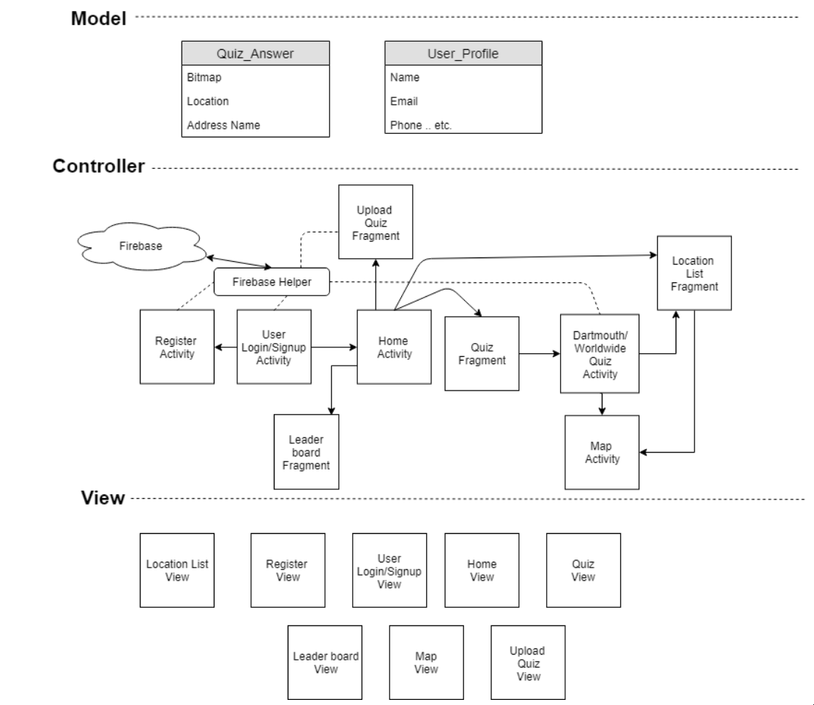

# Picture Locator
Picture Locator is an android app that tests the user's ability to guess the location in which a picture was taken. 

### Technologies used:
- Android Studio
- Java
- Google Maps API
- Firebase (for authentication and cloud database)

### Features
- Multiple user support through firebase.
- High Score Leaderboard that allows users to compare their best scores against each other.
- Users can submit their own questions by uploading pictures that have GPS metadata.
- Users can gauge their accuracy in each guess by looking at a Map which shows the pins of of other users who have made a guess in the same picture.
- Users can save and view a list of their favorite pictures.

### Code organization:
 MVC software design pattern
 

- Each [activity](Picture_Locator/app/src/main/java/com/example/picture_locator) (Roughly corresponding to each Screen in the app) is implemented on its own Java class.
- The [models](Picture_Locator/app/src/main/java/com/example/picture_locator/Models) define the main classes of objects used in the app.

## Authors
- Rodrigo Cavero Blades
- Yuteng Mei
